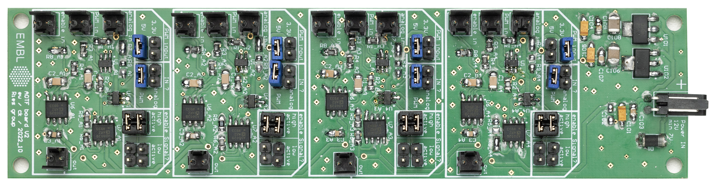
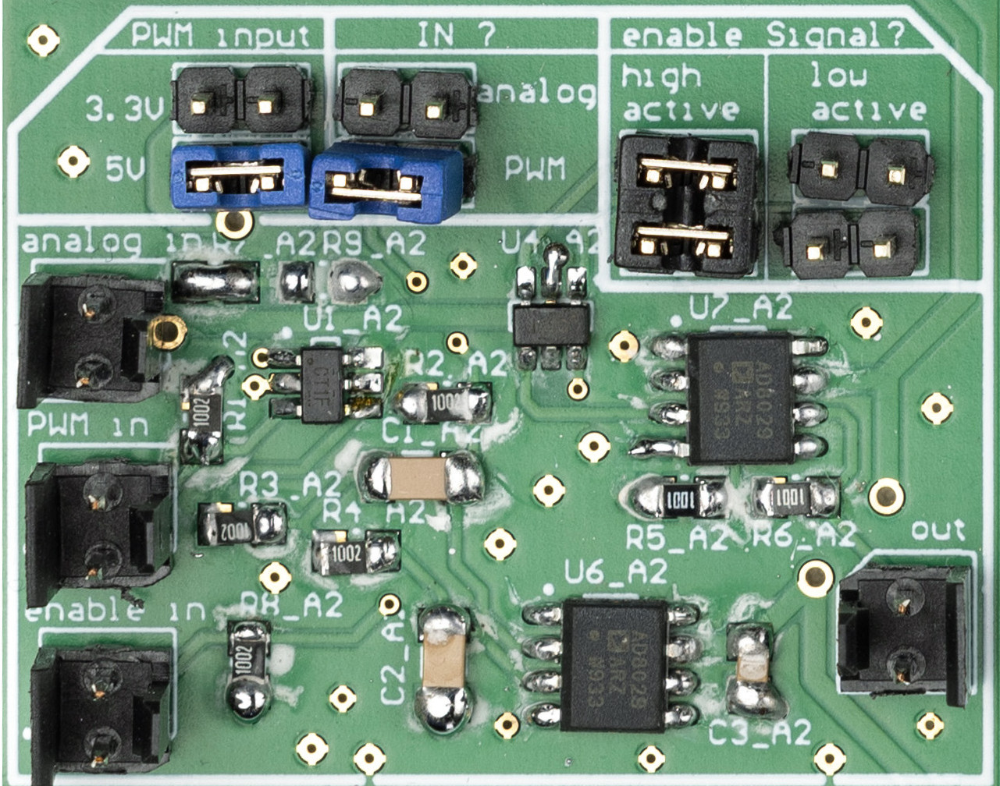

## Content

The AOTF conversion board takes two TTL inputs per channels:
1. Enable in: a TTL trigger such as the one generated by MicroFPGA laser triggers or a camera exposure signal.
2. DAQ or PWM: a PWM signal such as the one generated by MicroFPGA PWM signals.

The PWM signal is low-passed and the resulting analog output is multiplied by the TTL signal. The resulting output is a 5 V analog signal that can be synchronized with a camera, and whose level is adjusted by changing the PWM input duty cycle.

We used this board in addition to our electronics box in order to control AOTF/AOM, for instance with DPSS lasers.

- [Altium project](Altium_project)
- [Bill of materials](BOM)
- [Gerber files](Gerber)
- [Drill instructions](NC_Drill)

## Channel configuration

### Inputs
- _analog in_: analog signal that can be switched on or of by the _enable in_ signal.
- _PWM in_: PWM signal, which will be low-pass filtered by the board to generate an analog signal.
- _enable in_: TTL signal used to switch on and off the analog signal (_analog in_ or low-pass filtered _PWM in_)

> Important: inputs are either the analog or the PWM in, but not both simultaneously.

### Settings
- _PWM input_: voltage of the PWM input (if applicable), the output of the board is 5V and 3.3V inputs are rescaled.
- _IN ?_: whether the input is _analog in_ or _PWM in_
- _Enable signal ?_: whether the analog output is switched on on _HIGH_ or _LOW_ TTL.

