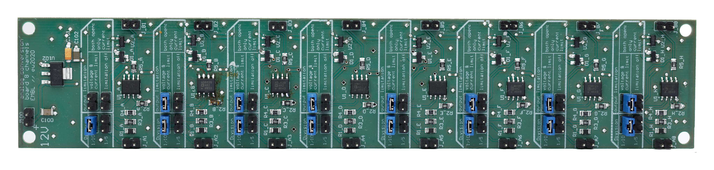

## Content

The analog conversion board (ACB) scales down analog voltages from the ranges 0-10 V or 0-5 V to 0-1 V, in order to measure signals with the Au+ FPGA.

- [Altium project](Altium_project)
- [Bill of materials](BOM)
- [Gerber files](Gerber)
- [Drill instructions](NC_Drill)

