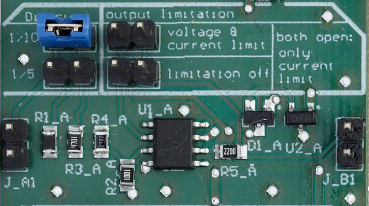

## Content

The analog conversion board (ACB) scales down analog voltages from the ranges 0-10 V or 0-5 V to 0-1 V, in order to measure signals with the Au+ FPGA.

- [Altium project](Altium_project)
- [Bill of materials](BOM)
- [Gerber files](Gerber)
- [Drill instructions](NC_Drill)

## Channel configuration

### Input
- analog signal in the range 0-10V or 0-5V.

### Output
- analog signal in the range 0-1V.

### Settings
- _Division_: whether the input analog signal is 0-10V (1/10) or 0-5V (1/5), the output of the board is 0-1V.
- _output limitation_:
  - _voltage and current limitations_: limits both voltage and current to prevent damaging the FPGA ADC.
  - _limitations off_: the output voltage and current are not limited.
  - both open, only current limitation.

Photography credit: EMBL Photolab - Stuart Ingham.
