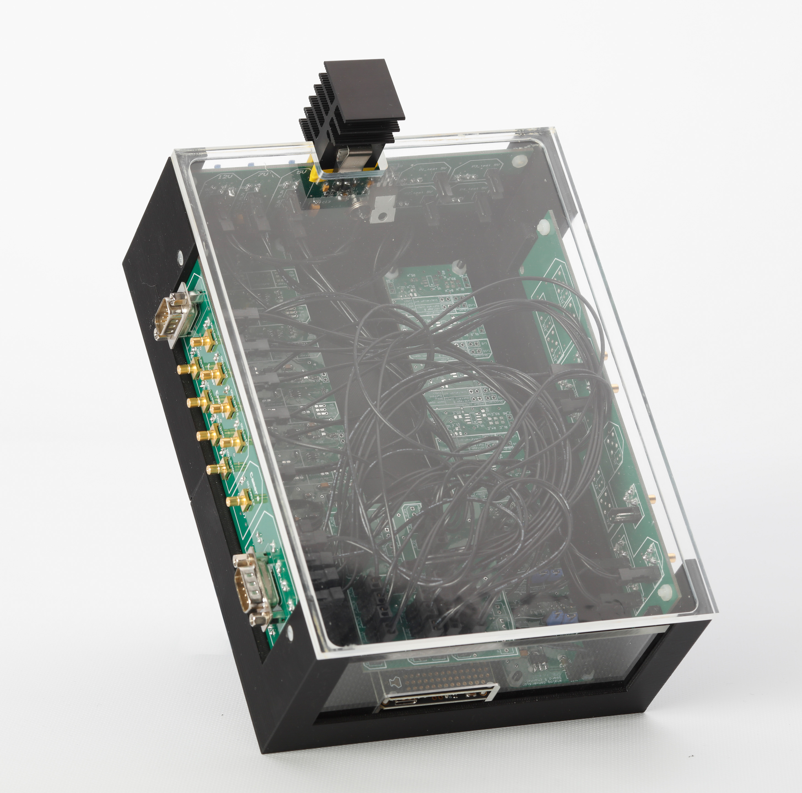

## Content

The electronics box packages the different boards into a neat box with standard connectors. It is 3D printed and the lid machined from transparent plastic.

- [Bill of materials](BOM)
- [Build up pictures](Build_up)
- [CAD files](CAD_files)

