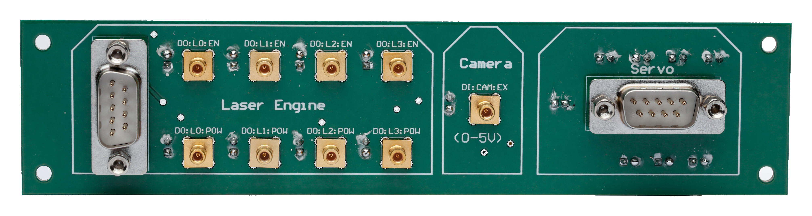

## Content

The first box panel is connected to the laser (DO:LX:EN) and PWM signals (DO:LX:POW), as well as camera trigger input and the servos. The lasers outputs can be used directly to trigger diode lasers. The servo DSUB9 is connected to the servo distribution board (SDB). The other DSUB9 connector can be used with the [LaserEngine](https://github.com/ries-lab/LaserEngine) electronics. Finally, both laser and PWM
signals could be used as inputs to the AOTF conversion board in order to control an AOTF or an AOM.

- [Altium project](Altium_project)
- [Bill of materials](BOM)
- [Gerber files](Gerber)
- [Drill instructions](NC_Drill)

