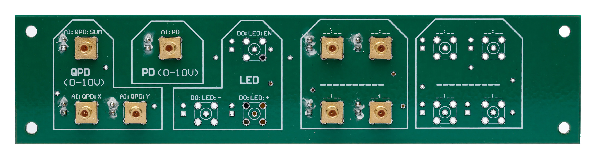

## Content

The second box panel is connected to AU+ analog inputs (in the case of the Cu FPGA, then these can be adapted for other outputs). It is
also wired to the TTL outputs and the camera trigger output.

