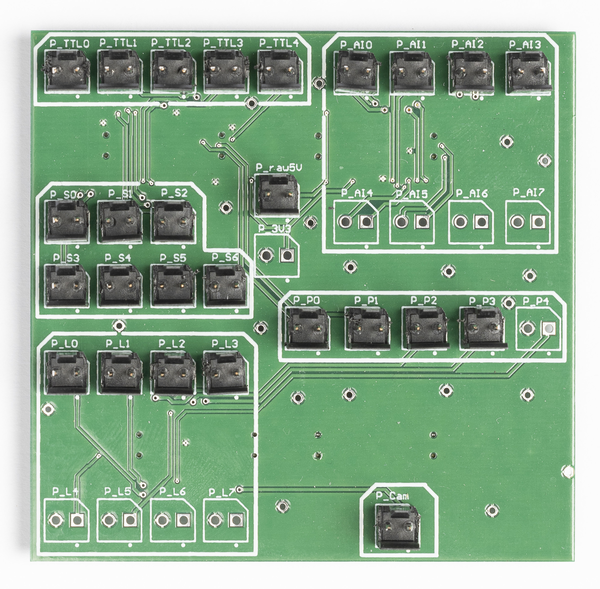

## Content

The custom FPGA shield can be plugged directly onto the Br shield (Alchitry) and facilitates the internal wiring of the electronics 
box. It features all the default inputs of MicroFPGA. Note that we prefer stacking it on top of the Br shield to avoid damaging the 
FPGA connectors.

