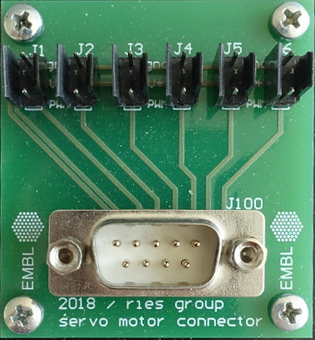

## Content

The servomotor distribution board (SDB) is intended to be a hub for servomotor cables. Placed in the center of the microscope, we use it to drive several servomotors (back-focal plane lens, 3D lens, filter wheels etc.), such as [the elements presented here](https://github.com/ries-lab/RiesPieces/tree/master/Microscopy). The flat cable from the DSUB9 is connected directly to the electronics box. It is simply screwed on a plastic board.

The project contains the following items:

- [Altium project](Altium_project)
- [Gerber files](Gerber)
- [Drill instructions](NC_Drill)

The board was designed by Ulf Matti (Ries lab, EMBL).
