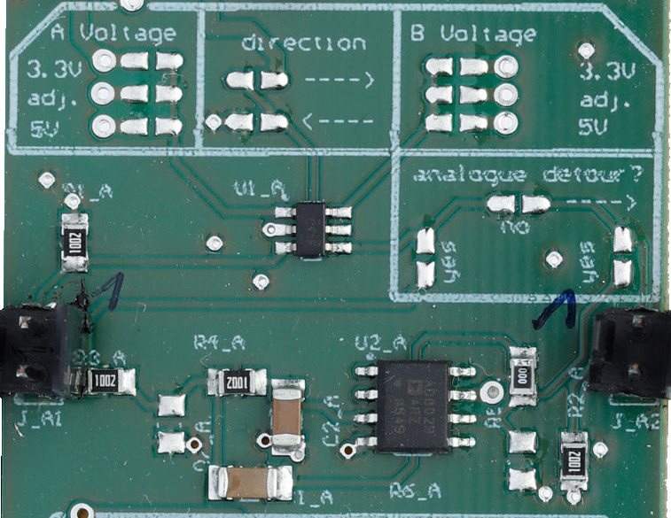

## Content

The signal conversion board (SCB) features multiple bi-directional channels that scale up or down voltages in order to ensure compatibility
between the FPGA and devices connected to the electronics box. Two channels also include the possibility to low pass the PWM signals 
from MicroFPGA to produce analog voltage ouputs.

- [Altium project](Altium_project)
- [Bill of materials](BOM)
- [Gerber files](Gerber)
- [Drill instructions](NC_Drill)

## Channel configuration

Signal A on the left-hand side, signal B on the right-hand side.

### Input
- Digital signal (in A or B).

### Output
- Rescaled digital (in A or B) or analog signal (B).

### Settings
- _A voltage_: left-hand side voltage, where _adj_ is the adjustable voltage at the top of the board.
- _direction_: voltage conversion from left to right or right to left.
- _B voltage_: right-hand side voltage, where _adj_ is the adjustable voltage at the top of the board.
- _analogue detour_: whether to low pass A to produce an analog signal in B.
  
 > __Important__: digital to analog conversion (low-pass filter) only happens from A to B, from left to right.

