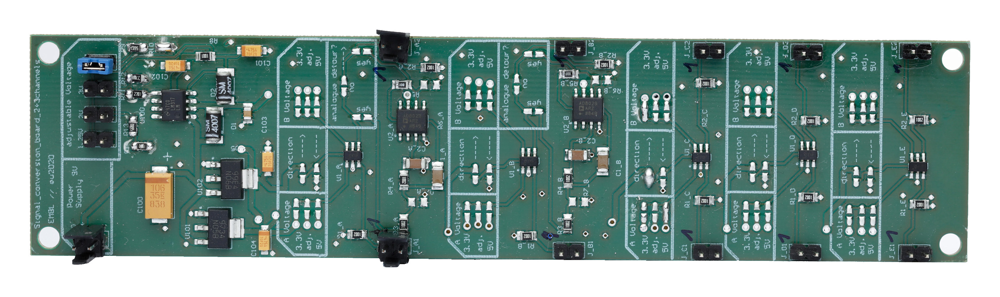

## Content

The signal conversion board (SCB) features multiple bi-directional channels that scale up or down voltages in order to ensure compatibility
between the FPGA and devices connected to the electronics box. Two channels also include the possibility to low pass the PWM signals 
from MicroFPGA to produce analog voltage ouputs.

- [Altium project](Altium_project)
- [Bill of materials](BOM)
- [Gerber files](Gerber)
- [Drill instructions](NC_Drill)

